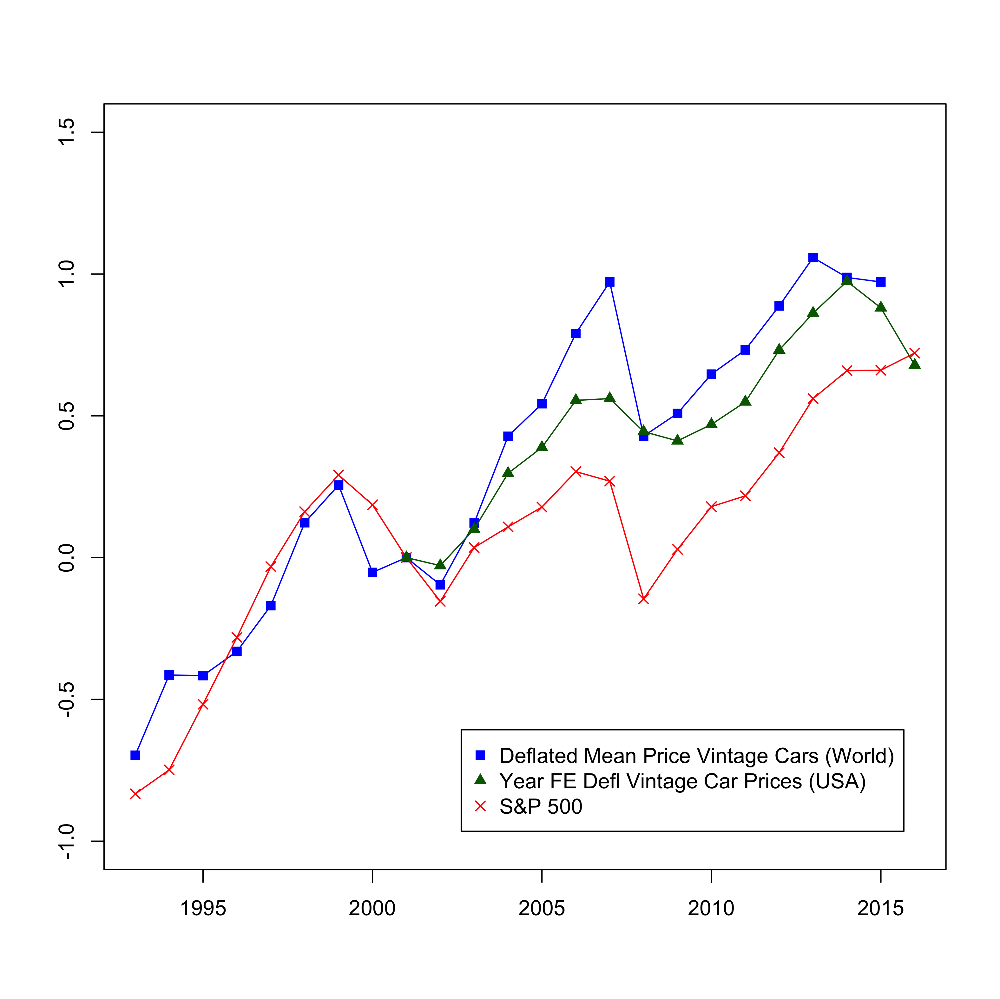

Vintage Car Auctions
=====================================

### News
June 2018
* Adding a documentation to the project

May 2018

April 2018

### Introduction

This project aims to create a novel approach of estimating a dynamic auction market for vintage cars. This allows user to enter simulation data
and stock data which will be used to correlate one's private wealth to his or her bidding potential.
* **Important**: The system assumes the presence of two files in the folder simulation_data. One being :
  * avgsp.csv
  * book_total_brand.csv

### Setting: Auctions for Vintage Cars
* These cars have direct use value but can also be resold
* Explicitly treat these cars as assets: Buyers anticipate selling in the future,
wealth evolves endogenously, and return on other assets potentially influences prices of vintage cars
* Similar in spirit to Bayer et al's (Econometrica 2016) model of demand for houses:
  * "We explicitly mohttps://github.com/Chaitanyadel housing as an asset and allow each household's wealth to evolve endogenously. Households in our model anticipate selling their homes at some point in the future and thus explicitly consider the expected evolution of neighborhood amenities and housing prices when deciding where and when to purchase (or sell) their house."
* The graph below shows that average prices have fluctuated strongly in recent years and are strongly correlated with the stock market
  * The (blue) squares plot the simple average of vintage cars sold in that year
  * The (green) dots plot the year coefficients of the year fixed effect from the following regression:
  * , where *i* indexes cars, *j* indexes model-year-built, *y* indexes the year
  * The (red) crosses plot the average S&P500
  * The observed correlation may be driven (among other things) by the income effect of a higher stock market and by arbitrage between the two markets that equalises returns.

{:height="36px" width="36px"}
